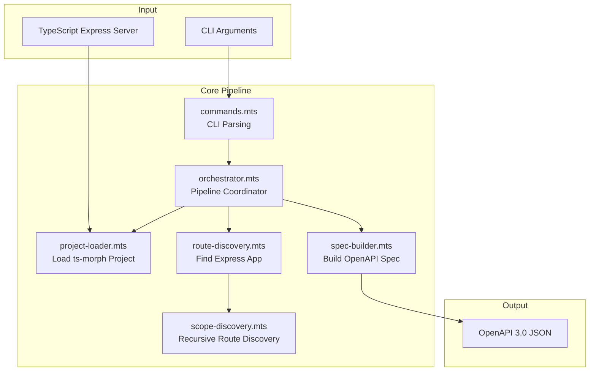
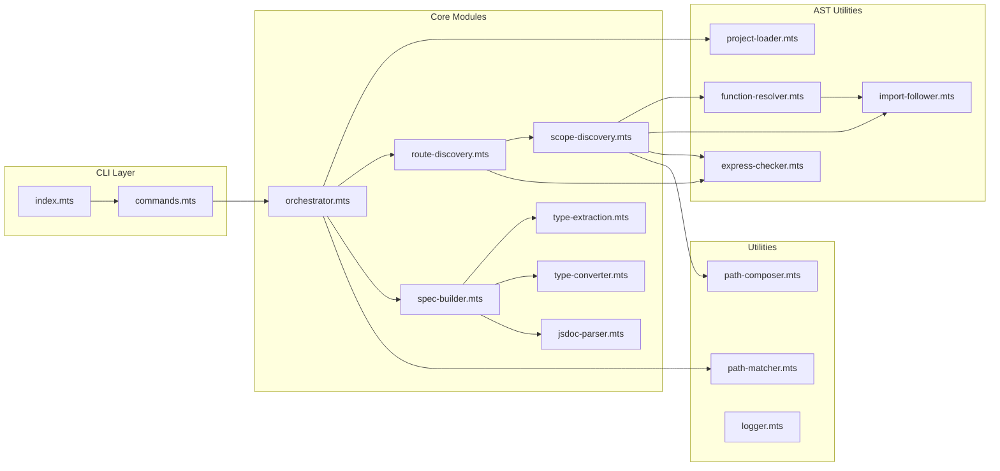
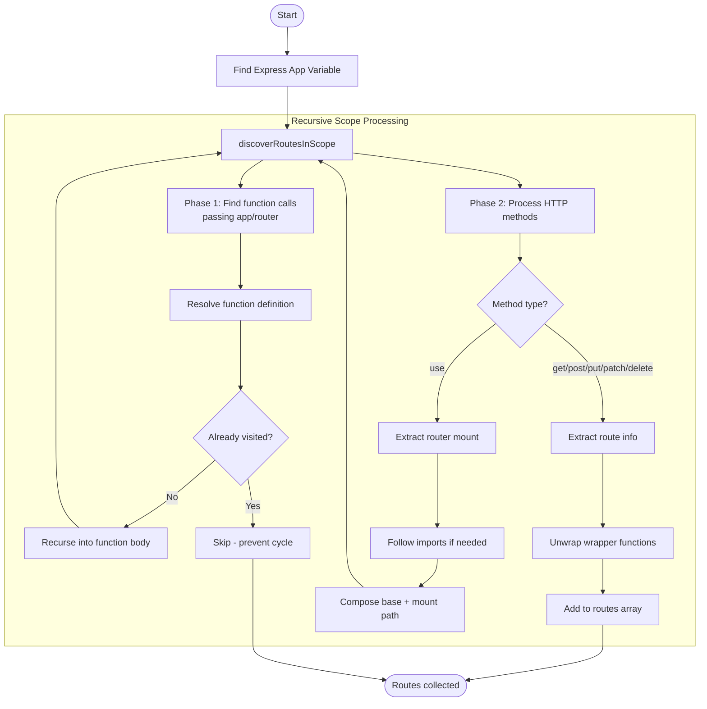
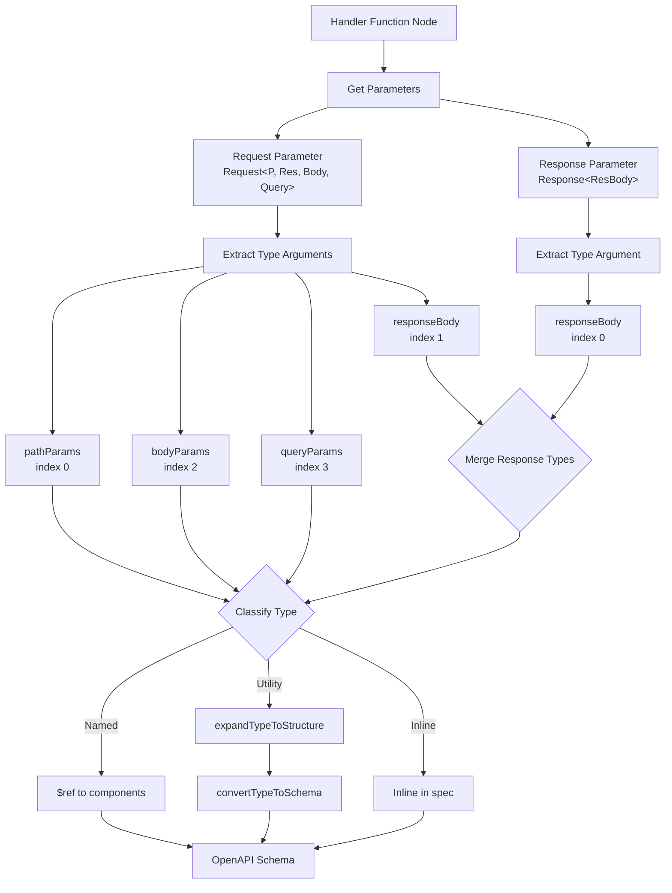
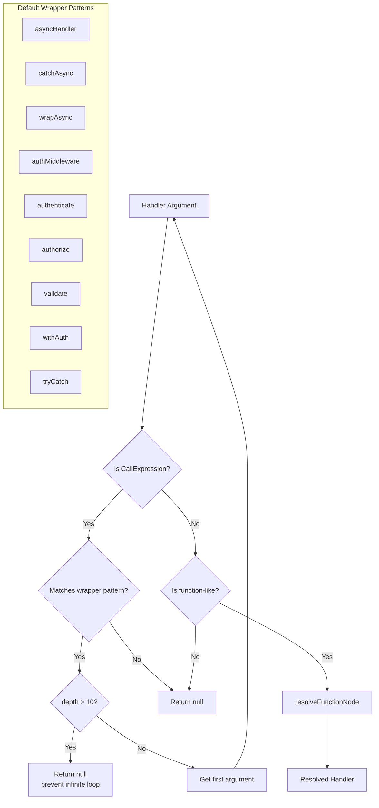
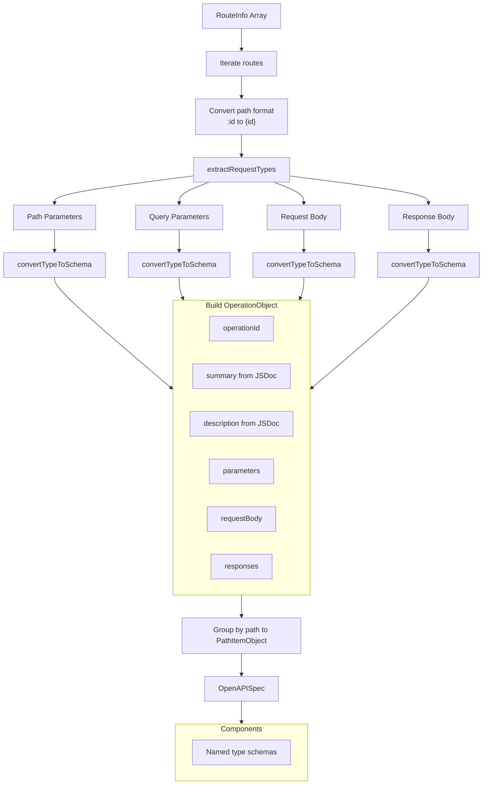
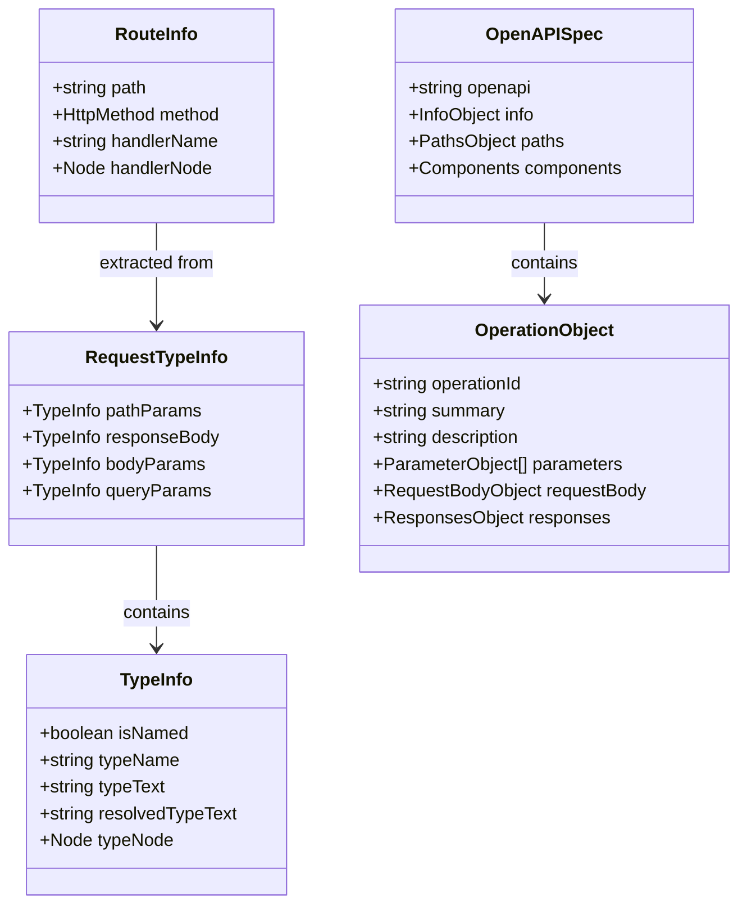

# express-to-openapi Architecture Overview

This document provides a comprehensive overview of the express-to-openapi codebase architecture.

## High-Level Data Flow



## Module Architecture



## Route Discovery Algorithm



## Type Extraction Flow



## Wrapper Unwrapping



## Spec Building Process



## Key Interfaces



## File Structure

```
src/
├── index.mts              # Entry point
├── cli/
│   └── commands.mts       # CLI definition
├── core/
│   ├── orchestrator.mts   # Pipeline coordinator
│   ├── route-discovery.mts    # Find Express app
│   ├── scope-discovery.mts    # Recursive route finding
│   ├── spec-builder.mts       # Build OpenAPI spec
│   ├── type-extraction.mts    # Extract Request/Response types
│   ├── type-converter.mts     # TS → JSON Schema
│   └── jsdoc-parser.mts       # JSDoc extraction
├── ast/
│   ├── project-loader.mts     # Load ts-morph project
│   ├── express-checker.mts    # Detect Express patterns
│   ├── function-resolver.mts  # Resolve & unwrap handlers
│   └── import-follower.mts    # Follow imports
├── utils/
│   ├── path-composer.mts      # Compose route paths
│   ├── path-matcher.mts       # Ignore pattern matching
│   └── logger.mts             # Logging
└── types/
    ├── internal.mts           # Internal interfaces
    └── openapi.mts            # OpenAPI type definitions
```

## Core Modules

### CLI Layer

| Module | Purpose |
|--------|---------|
| `index.mts` | Executable entry point |
| `commands.mts` | CLI definition via Commander.js |

### Core Pipeline

| Module | Purpose |
|--------|---------|
| `orchestrator.mts` | Pipeline coordinator - loads project, discovers routes, builds spec |
| `route-discovery.mts` | Finds Express app variable, delegates to scope-discovery |
| `scope-discovery.mts` | **Main algorithm** - recursive route discovery within scopes |
| `spec-builder.mts` | Constructs OpenAPI paths/operations from routes |
| `type-extraction.mts` | Extracts types from `Request<P, Res, Body, Query>` and `Response<ResBody>` |
| `type-converter.mts` | Converts TypeScript types to JSON Schema via `typeconv` |
| `jsdoc-parser.mts` | Extracts summary/description from JSDoc comments |

### AST Utilities

| Module | Purpose |
|--------|---------|
| `project-loader.mts` | Loads TypeScript project via ts-morph |
| `express-checker.mts` | Detects `express()` and `Router()` patterns |
| `function-resolver.mts` | Resolves handlers, unwraps wrappers (asyncHandler, etc.) |
| `import-follower.mts` | Follows imports across files to resolve handlers/routers |

### Utilities

| Module | Purpose |
|--------|---------|
| `path-composer.mts` | Composes paths for nested routers |
| `path-matcher.mts` | Glob pattern matching for ignore paths |
| `logger.mts` | Structured logging with colors |

## External Dependencies

| Library | Purpose |
|---------|---------|
| **ts-morph** | TypeScript AST manipulation & type checking |
| **typeconv** | TypeScript → JSON Schema conversion |
| **commander** | CLI argument parsing |
| **winston** | Structured logging |
| **chalk** | Terminal colors |

## Key Patterns

### 1. Recursive Route Discovery
`discoverRoutesInScope()` recursively processes scopes, tracking visited functions to prevent cycles.

### 2. Wrapper Unwrapping
Handles patterns like `asyncHandler(handler)`, `authMiddleware(handler)` - unwraps up to 10 levels deep to extract inner handler types.

**Default wrapper names:** `asyncHandler`, `catchAsync`, `wrapAsync`, `authMiddleware`, `authenticate`, `authorize`, `validate`, `withAuth`, `tryCatch`

**Custom patterns via CLI:** `-w "myWrapper.*"` matches any wrapper name starting with "myWrapper"

### 3. Router Mounting
Follows `app.use(path, router)` calls, composing full paths from nested routers.

### 4. Import Following
Resolves handlers/routers across files via named and default imports.

### 5. Type Extraction
Uses TypeScript's typeChecker to resolve complex types:
- Utility types: `Partial<T>`, `Pick<T>`, `Omit<T>`, `Record<K,V>`
- Union/intersection types: `A | B`, `A & B`
- Zod inferred types: `z.infer<typeof Schema>`
- Nested types with circular reference detection

### 6. Component Schemas
Named types extracted to `components.schemas` with `$ref` references.

## Known Limitations

- Dynamic/runtime-generated routes not supported
- No decorator support currently
- Deeply nested conditional types may not fully resolve
- Max wrapper unwrapping depth: 10 levels
